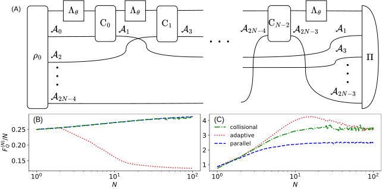

.. _sec:collisional:

Collisional strategy
--------------------

.. _fig:passive:

   (A) Diagram of a collisional strategy with multiple parametrized channels
   :math:`\Lambda_\theta` and ancillas :math:`\mathcal{A}_i`. Values of QFI normalized
   by the number of channel uses, :math:`N`, for: (B) dephasing (:math:`p=0.75`),
   (C) amplitude damping (:math:`p=0.75`) and different strategies: adaptive
   (:math:`d_\mathcal{A}=2`) – blue dashed line, parallel
   (:math:`d_\mathcal{A}=2,\; r_\mathrm{MPS}=\sqrt{r_\mathfrak{L}}=2`) – red dotted line,
   collisional (:math:`d_\mathcal{A}=2,\; r_\mathrm{MPS}=\sqrt{r_\mathfrak{L}}=2`) – green
   dash-dotted line. Fluctuations for larger :math:`N` are due to numerical
   instabilities.

We will describe the creation of a custom strategy using the example of a
*collisional strategy* depicted in :numref:`fig:passive` (A). Physically, we can
imagine this scheme to represent a situation where multiple particles,
potentially entangled with each other initially, approach the sensing system one
by one. They interact locally with the system via control operations
:math:`\mathrm{C}_i`, carrying away information about the parameter while at the same
time causing some back-action on the sensing system itself.

This strategy may be viewed as a hybrid of the parallel and the adaptive
strategies where each control operation :math:`\mathrm{C}_i` has its own ancilla
which is measured immediately after the action of :math:`\mathrm{C}_i`. Notice that
if all :math:`\mathrm{C}_i` were set to SWAP gates one would regain the parallel
strategy. On the other hand, this strategy does not allow control operations to
communicate with each other like in the most general adaptive strategy.
Therefore the QFI for this strategy must be at least as good as for the parallel
strategy but in general will be worse than for the adaptive strategy with an
ancilla dimension :math:`d_\mathcal{A}^{N-1}`, where :math:`d_\mathcal{A}` is the dimension
of a single ancillary system in the collisional strategy.

We can now create a tensor network representing the collisional strategy. In the
following we will use functions from
:mod:`creators/single <qmetro.qmtensor.creators.single>` and
:mod:`creators/structures <qmetro.qmtensor.creators.structures>`.
These functions greatly simplify the process by creating
entire structures (for example the density matrix of an MPS) and they make the
code more readable. Let us start by defining the necessary spaces:

.. code-block:: python

   from qmetro import *

   # Number of parametrized channels:
   N = 10
   d_a = 2  # Ancilla dimension.

   sd = SpaceDict()

   # arrange_spaces will create a series of spaces:
   # ('INP', 0), ..., ('INP', N-1)
   # with specified dimension and it will return a list of their names:
   # > input spaces of parametrized channels:
   inp = sd.arrange_spaces(N, 2, 'INP')
   # > output spaces of parametrized channels:
   out = sd.arrange_spaces(N, 2, 'OUT')
   # > ancillas:
   anc = sd.arrange_spaces(2*N-2, 2, 'ANC')

The input state can be created using
:py:func:`input_state_var <qmetro.qmtensor.creators.structures.input_state_var>`
or
:py:func:`mps_var_tnet <qmetro.qmtensor.creators.structures.mps_var_tnet>`:

.. code-block:: python

   # First input space and ancillas with even indices:
   spaces = [inp[0]] + anc[::2]
   rho = input_state_var(spaces, name='RHO0', sdict=sd)

   # In case we want to optimize over MPSs:
   r_mps = 2  # MPS bond dimension.
   rho0 = input_state_var(spaces, 'RHO0', sd, mps_bond_dim=r_mps)
   # or equivalently:
   rho0, rho0_names, rho0_bonds = mps_var_tnet(spaces, 'RHO0', sd, r_mps)

Both of these functions create the same MPS but
:py:func:`mps_var_tnet <qmetro.qmtensor.creators.structures.mps_var_tnet>` returns
additionally names of its components and bond spaces which might become useful
later for accessing the optimization results.

Tensors of parameter-encoding channels can be created using the
:py:meth:`tensor <qmetro.param_channel.param_channel.ParamChannel.tensor>`
method from the
:py:class:`ParamChannel <qmetro.param_channel.param_channel.ParamChannel>`
class:

.. code-block:: python

   # Parameter-encoding channel:
   channel = par_dephasing(0.75)

   # This will be the tensor network of our
   # strategy:
   tnet = rho0

   # Adding channels to tnet:
   for i in range(N):
       inp_i = inp[i]  # i-th input space.
       out_i = out[i]  # i-th output space.
       pt = channel.tensor([inp_i], [out_i], sdict=sd, name=f'CHANNEL{i}')
       tnet = tnet * pt

We want the control operations to be CPTP maps, hence we will use
:py:func:`cptp_var <qmetro.qmtensor.creators.single.cptp_var>` creator:

.. code-block:: python

   for i in range(N-1):
       c_inp = [out[i], anc[2*i]] # i-th control input spaces
       c_out = [inp[i+1], anc[2*i+1]] # i-th control output spaces
       # Variable control operation:
       vt = cptp_var(c_inp, c_out, sdict=sd, name=f'CONTROL{i}')
       tnet = tnet * vt

Similarly to the input state, the measurement can be created in one of
two ways:

.. code-block:: python

   # Ancillas with odd indices and last output space:
   spaces = anc[1::2] + [out[-1]]
   Pi = measure_var(spaces, name='Pi', sdict=sd)

   # In case we want to optimize over pre-SLD which is MPO:
   r_L = r_mps * r_mps  # pre-SLD bond dim.
   Pi = measure_var(spaces, 'Pi', sd, bond_dim=r_L)
   # or equivalently:
   Pi, Pi_names, Pi_bonds = mpo_measure_var_tnet(spaces, 'Pi', sd, r_L)

   tnet = tnet * Pi

In summary, the code is:

.. code-block:: python

   from qmetro import *

   ch = par_dephasing(0.75)  # Channel.
   N = 10  # Number of channels.
   d_a = 2  # Ancilla dimension.
   r_mps = 2  # MPS bond dimension.
   r_L = r_mps**2  # pre-SLD bond dimension.

   sd = SpaceDict()
   inp = sd.arrange_spaces(N, 2, 'INP')
   out = sd.arrange_spaces(N, 2, 'OUT')
   anc = sd.arrange_spaces(2*N-2, 2, 'ANC')

   rho0_spaces = [inp[0]] + anc[::2]
   rho0, rho0_names, rho0_bonds = mps_var_tnet(rho0_spaces, 'RHO0', sd, r_mps)

   tnet = rho0
   for i in range(N):
       pt = ch.tensor([inp[i]], [out[i]], sdict=sd, name=f'CHANNEL{i}')
       tnet = tnet * pt

   for i in range(N-1):
       vt = cptp_var(
           [out[i], anc[2*i]], [inp[i+1], anc[2*i+1]],
           sdict=sd, name=f'CONTROL{i}'
       )
       tnet = tnet * vt

   spaces = anc[1::2] + [out[-1]]
   Pi, Pi_names, Pi_bonds = mpo_measure_var_tnet(spaces, 'Pi', sd, r_L)

   tnet = tnet * Pi

To optimize our strategy, we need to simply put it into
:py:func:`iss_opt <qmetro.iss_opt.main.iss_opt>`:

.. code-block:: python

   qfi, qfis, tnet_opt, status = iss_opt(tnet)

where ``qfi`` is the optimized QFI, ``qfis`` is a list of pre-QFI values per
iteration, ``status`` tells whether the optimization converged successfully and
``tnet_opt`` is a copy of ``tnet`` where each
:py:class:`VarTensor <qmetro.qmtensor.classes.tensors.VarTensor>`
is replaced with a
:py:class:`ConstTensor <qmetro.qmtensor.classes.tensors.ConstTensor>`
storing the result of the strategy optimization. To access those
values we need to use the names of the required tensor and its spaces:

.. code-block:: python

   i = 2

   # Accessing the CJ matrix of the i-th control operation:
   name = f'CONTROL{i}'
   # i-th control operation tensor:
   C_i = tnet_opt.tensors[name]

   spaces = [inp[i+1], anc[2*i+1], out[i], anc[2*i]]
   # CJ matrix with spaces in the order given by the argument:
   choi = C_i.choi(spaces)

   # Accessing the i-th element of the MPS density matrix:
   name = rho0_names[i]
   # i-th element of the state's density MPO:
   rho0_i = tnet_opt.tensors[name]

   spaces = [rho0_bonds[i-1], rho0_spaces[i], rho0_bonds[i]]
   # MPS element with indices in the order given by the argument:
   psi_i = rho0_i.to_mps(spaces)

:numref:`fig:passive` (B) and (C) show the optimized values of the QFI for the
collisional strategy together with the parallel and the adaptive ones for
comparison. It turns out that in the case of the dephasing noise (B), additional
control operations do not help and the results are the same as for the parallel
strategy. On the other hand, for the amplitude damping noise (C) the collisional
strategy is significantly better than the parallel one and appears to be able
to beat the adaptive strategy for :math:`N>100`, under the given limited
ancillary dimensions. This proves that in this case, the optimal strategy found
is qualitatively different from both the parallel and the adaptive ones.
