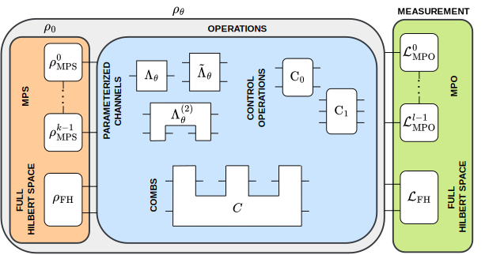

.. _sec:advanced:

Advanced package usage---optimization of strategies with arbitrary structures
=============================================================================

.. _fig:gen_str:

   Diagram of a strategy with arbitrary structure that can be optimized using
   :py:func:`iss_opt <qmetro.iss_opt.main.iss_opt>`. The input state,
   :math:`\rho_0`, might
   consist of MPSs and/or states on a full Hilbert space. The input state goes
   through an arbitrary arrangement of parametrized channels, control
   operations and combs. The requirement is that each operation's output can be
   connected only to the input of a different operation such that there are no
   causal cycles. Finally, the state obtained after application of each
   operation, :math:`\rho_\theta`, is measured. The measurement is specified by
   the form of the pre-SLD matrix :math:`\mathfrak{L}` which can be an MPO and/or
   a matrix on a full Hilbert space. States, control operations, and combs can be
   marked as variable or constant, the pre-SLD must be variable and the
   parametrized channels must be constant.

In addition to the functions presented in :ref:`sec:basic`, the QMetro++ allows
the user to define their own strategy and then optimize it using the ISS
algorithm. Strategies are defined via a straightforward-to-use symbolic
programming framework. The user creates a tensor network representing their
strategy where some of the nodes are marked as constants and others are marked
as variables to be optimized over---let us call the set of variables
:math:`\mathcal{V}`. This strategy is then plugged into the function
:py:func:`iss_opt <qmetro.iss_opt.main.iss_opt>` which, based on
the provided data, constructs the pre-QFI:

.. math::
   :label: eq:preqfi_many

   F(\mathcal{V}) = 2\mathrm{Tr}(\dot{\rho}_\theta\mathfrak{L}) -
   \mathrm{Tr}(\rho_\theta\mathfrak{L}^2),

where :math:`\rho_\theta` and :math:`\mathfrak{L}` are defined as in
:numref:`fig:gen_str` and :math:`\dot{\rho}_\theta` is created from
:math:`\rho_\theta` using the Leibniz (chain) rule. Then the function optimizes
the above pre-QFI over each variable node one by one in a typical ISS manner.

In :ref:`sec:qmtensor` we explain the classes of QMetro++
:ref:`tensors <sec:api_tensors>`
which are the building blocks of strategies.
Then in :ref:`sec:collisional` we show how such a strategy can be
created using the example of the collisional metrological model.

.. toctree::
   :maxdepth: 1

   qmtensor
   collisional
