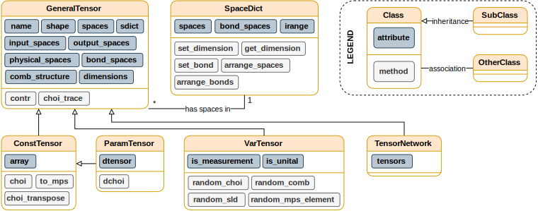

.. _sec:qmtensor:

QMetro++ tensors
================

A general strategy in QMetro++ is created by defining it as a tensor network of:

- density matrices,
- elements of MPOs of density matrices, in particular density matrices of MPSs
  (see :numref:`eq:mps_density_mat`),
- parameter-encoding channels,
- control operations,
- quantum combs,
- measurements,
- elements of measurement MPOs.

connected by their physical and bond spaces, as in the diagram in
:numref:`fig:gen_str`. Some input states, control operations, and quantum combs
as well as all measurements, are marked as variables of the pre-QFI function
:eq:`eq:preqfi_many` and they will be optimized by the ISS algorithm. Each
non-measurement node is represented using its tensor representation (see a
detailed explanation in :ref:`sec:tensor_networks`) and
measurements are represented via a tensor representation of the pre-SLD matrix
:math:`\mathfrak{L}`.

.. _fig:classes:

   UML diagram of classes used for creation of strategies with their most
   important attributes and methods. Subclasses inherit all attributes and
   methods of their parent class. Instances of
   :py:class:`GeneralTensor <qmetro.qmtensor.classes.tensors.GeneralTensor>` and
   its subclasses can access a
   :py:class:`SpaceDict <qmetro.qmtensor.classes.tensors.SpaceDict>`
   instance through their
   :py:attr:`sdict <qmetro.qmtensor.classes.tensors.GeneralTensor.sdict>`
   attribute. Two tensors can be contracted with each other only when they have the same
   :py:attr:`sdict <qmetro.qmtensor.classes.tensors.GeneralTensor.sdict>`
   attribute.

In practice, this means that each node of the network has to be initialized as
an object of a QMetro++ tensor class (see :numref:`fig:classes`). There are five
kinds of tensor classes:

- :py:class:`GeneralTensor <qmetro.qmtensor.classes.tensors.GeneralTensor>` — a class containing
  attributes and methods common to all tensors, such as the shape or the
  contraction operation. It is an *abstract class* i.e. it is only a blueprint
  for other classes to inherit from and it is not meant to be used in any
  computations directly.
- :py:class:`ConstTensor <qmetro.qmtensor.classes.tensors.ConstTensor>` — a class representing tensors
  that stay constant during the optimization process.
- :py:class:`ParamTensor <qmetro.qmtensor.classes.tensors.ParamTensor>` — a subclass of
  :py:class:`ConstTensor <qmetro.qmtensor.classes.tensors.ConstTensor>` which has an additional
  attribute defining its derivative over the measured parameter :math:`\theta`. It is
  meant to represent parameter-encoding channels :math:`\Lambda_\theta`.
- :py:class:`VarTensor <qmetro.qmtensor.classes.tensors.VarTensor>` — a class representing tensors
  that are optimized by the ISS algorithm. Members of this class store
  information specifying how they should be initialized and optimized (for
  example that they are CPTP channels, quantum combs or pre-SLD matrices) but
  they do not have any value — they are only symbols.
- :py:class:`TensorNetwork <qmetro.qmtensor.classes.tensors.TensorNetwork>` — networks of constant,
  parametrized and variable tensors.

Additionally, there is one more class,
:py:class:`SpaceDict <qmetro.qmtensor.classes.tensors.SpaceDict>`,
that stores the information about
the names, dimensions and types of the respective spaces. For example:

.. code-block:: python

   import numpy as np
   from qmetro import *

   sd = SpaceDict()
   # Adding physical spaces with names
   # 'a', 'b' and dimension 2 to sd.
   sd['a'] = 2
   sd['b'] = 2

   # Calling sd['a'] will return
   # the dimension of space 'a'.
   print(sd['a'])  # Prints 2.

   # Adding bond space 'x':
   sd.set_bond('x', 4)
   print(sd['x'])  # Prints 4.

   # Accessing range of appropriate index:
   print(sd.irange['a'])  # Prints 4.
   print(sd.irange['x'])  # Prints 4.

Note that the range of the physical index is equal to the square of the
dimension of the corresponding space. This is because physical indices are
created by joining two indices of a CJ operator. However, this is not the case
for bond indices which are not related to any Hilbert spaces. See detailed
discussion in :ref:`sec:tensor_networks`.

Instances of tensors are created on spaces defined in the
:py:class:`SpaceDict <qmetro.qmtensor.classes.tensors.SpaceDict>`:

.. code-block:: python

   ...

   # Constant tensor can be initialized
   # from a CJ matrix:
   id_ab = np.identity(sd['a'] * sd['b'])
   ct0 = ConstTensor(
       ['a', 'b'], choi=id_ab, sdict=sd
   )

   # Its tensor representation is in array
   # attribute:
   ct0_ten_rep = ct0.array
   # Order of its indices is in spaces
   # attribute:
   spaces = ct0.spaces

   # Constant tensor can be initialized
   # from its tensor representation
   ct1 = ConstTensor(spaces, array=ct0_ten_rep, sdict=sd)

   # Parametrized tensor requires both its
   # value and derivative. For example
   # a tensor with trivial derivative will
   # be:
   zeros = np.zeros_like(id_ab)
   pt = ParamTensor(spaces, sdict=sd, choi=id_ab, dchoi=zeros)

Variable tensors require only spaces. Their type is derived from additional
attributes:

.. code-block:: python

   ...

   spaces = ['a', 'b']
   bonds = ['x']

   # Variable tensor:
   vt0 = VarTensor(spaces, sd)

   # Types:
   # > state:
   vt1 = VarTensor(spaces, sd, output_spaces=spaces)
   # > element of a density matrix of
   # an MPS:
   vt1 = VarTensor(spaces + bonds, sd, output_spaces=spaces)
   # > CPTP map of a channel 'a'->'b':
   vt1 = VarTensor(spaces, sd, output_spaces=['b'])
   # > pre-SLD:
   vt2 = VarTensor(spaces, sd, is_measurement=True)
   # > element of a pre-SLD MPO:
   vt2 = VarTensor(spaces + bonds, sd, is_measurement=True)

Tensors can be contracted using either
:py:meth:`contr <qmetro.qmtensor.classes.tensors.GeneralTensor.contr>`
method (or function :py:func:`contr <qmetro.qmtensor.operations.contr>`)
or the star ``*`` symbol:

.. code-block:: python

   from qmetro import *

   channel = par_dephasing(0.75)
   choi = channel.choi()

   sd = SpaceDict()
   spaces = ['a', 'b', 'c']
   for space in spaces:
       sd[space] = 2

   ct0 = ConstTensor(['a', 'b'], choi, sd)
   ct1 = ConstTensor(['b', 'c'], choi, sd)

   # Contraction of 'b' space.
   ct2 = ct0.contr(ct1)
   # or equivalently
   ct2 = contr(ct0, ct1)
   # or equivalently
   ct2 = ct0 * ct1

While contraction of two
:py:class:`ConstTensors <qmetro.qmtensor.classes.tensors.ConstTensor>`
simply creates a new
:py:class:`ConstTensor <qmetro.qmtensor.classes.tensors.ConstTensor>`
this is not the case when one of the contracted tensors is a
:py:class:`VarTensor <qmetro.qmtensor.classes.tensors.VarTensor>` because it
does not have any value. Contraction with a
:py:class:`VarTensor <qmetro.qmtensor.classes.tensors.VarTensor>` creates a
:py:class:`TensorNetwork <qmetro.qmtensor.classes.tensors.TensorNetwork>`
consisting of the two tensors:

.. code-block:: python

   ...

   ct = ConstTensor(['a', 'b'], choi, sd)
   vt = VarTensor(['b', 'c'], sd)
   # Tensor network of ct and vt connected by 'b' space:
   tn = ct * vt

   # Elements of tensor network can be  accessed using tensor and name attributes:
   print(tn.tensors[ct.name] is ct)  # True.
   print(tn.tensors[vt.name] is vt)  # True.

Similarly, a contraction with a :py:class:`TensorNetwork
<qmetro.qmtensor.classes.tensors.TensorNetwork>` creates another
:py:class:`TensorNetwork <qmetro.qmtensor.classes.tensors.TensorNetwork>`. The
results of all possible contraction combinations are presented in
:numref:`tab:link_types`.

.. _tab:link_types:

.. table:: Table of contraction types.
   :align: center

   +-----+-------+-------+-------+-------+-------+
   |``*``|  GT   |  CT   |  PT   |  VT   |  TN   |
   +-----+-------+-------+-------+-------+-------+
   | GT  | Error | Error | Error | Error | Error |
   +-----+-------+-------+-------+-------+-------+
   | CT  | Error |  CT   |  PT   |  TN   |  TN   |
   +-----+-------+-------+-------+-------+-------+
   | PT  | Error |  PT   |  PT   |  TN   |  TN   |
   +-----+-------+-------+-------+-------+-------+
   | VT  | Error |  TN   |  TN   |  TN   |  TN   |
   +-----+-------+-------+-------+-------+-------+
   | TN  | Error |  TN   |  TN   |  TN   |  TN   |
   +-----+-------+-------+-------+-------+-------+

Resulting type of a contraction of various tensor pairs:
GT — :py:class:`GeneralTensor <qmetro.qmtensor.classes.tensors.GeneralTensor>`,
CT — :py:class:`ConstTensor <qmetro.qmtensor.classes.tensors.ConstTensor>`,
PT — :py:class:`ParamTensor <qmetro.qmtensor.classes.tensors.ParamTensor>`,
VT — :py:class:`VarTensor <qmetro.qmtensor.classes.tensors.VarTensor>`,
TN — :py:class:`TensorNetwork <qmetro.qmtensor.classes.tensors.TensorNetwork>`.
Contraction with generalized tensor raises an error because instances of this
class are not meant to be used in calculations. When
:py:class:`ParamTensor <qmetro.qmtensor.classes.tensors.ParamTensor>` is
contracted with a
:py:class:`ConstTensor <qmetro.qmtensor.classes.tensors.ConstTensor>` or a
:py:class:`ParamTensor <qmetro.qmtensor.classes.tensors.ParamTensor>` the
derivative of the result is computed using the Leibniz (chain) rule.
