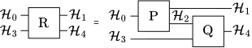

.. _sec:link_prod:

Choi-Jamiołkowski matrix and the link product
---------------------------------------------

When discussing networks of channels it is useful to introduce the notion of the
*Choi-Jamiołkowski matrix* (CJ). For a linear map

.. math::
   :label: eq:channel_P

   \mathrm{P} : \mathcal{L}\left( \mathcal{A} \right)
   \mapsto \mathcal{L}\left( \mathcal{B} \right),

the corresponding CJ matrix is given by
:cite:`Chiribella2009,Bengtsson2006`:

.. math::
   :label: eq:choi_P

   P = \left( \mathrm{P} \otimes \mathbb{I}_{\mathcal{A}} \right)
   \left( \ket{\Phi}\bra{\Phi} \right)
   \in \mathcal{L}\left( \mathcal{B} \otimes \mathcal{A} \right),

where :math:`\ket{\Phi}=\sum_i \ket{i}\otimes \ket{i}` is a non-normalized
maximally entangled state on :math:`\mathcal{A} \otimes \mathcal{A}`. In what
follows, CJ matrices of maps (e.g. map :math:`\mathrm{P}`) will be denoted with
the same symbol but in italics (e.g. :math:`P`). CJ matrix :math:`P` has many
useful properties :cite:`Bengtsson2006`:

.. _en:choi_properties:

.. rubric:: CJ operator properties

For a map :math:`\mathrm{P}` from :eq:`eq:channel_P` and its CJ matrix defined by
formula :eq:`eq:choi_P` the following properties are satisfied:

#. if :math:`\mathrm{P}` represents a state preparation procedure then
   :math:`P` is the density matrix of the state it produces,
#. if :math:`\mathrm{P} = \mathrm{Tr}_{\mathcal{A}}` represents the partial trace
   with respect to :math:`\mathcal{A}` then :math:`P` is the identity matrix on
   :math:`\mathcal{A}`,
#. :math:`\mathrm{P}` is completely positive if and only if :math:`P` is positive
   semidefinite,
#. :math:`\mathrm{P}` is trace-preserving if and only if
   :math:`\mathrm{Tr}_{\mathcal{B}} P = \mathbb{1}_{\mathcal{A}}`,
#. :math:`\mathrm{P}` is unital, that is
   :math:`\mathrm{P}(\mathbb{1}_{\mathcal{A}}) = \mathbb{1}_{\mathcal{B}}`, if and
   only if :math:`\mathrm{Tr}_{\mathcal{A}} P = \mathbb{1}_{\mathcal{B}}`.

Additionally, for two maps:

.. math::
   :label: eq:chanels_example

   \begin{aligned}
   \mathrm{P} &: \mathcal{L}\left( \mathcal{H}_0 \right)
      \mapsto \mathcal{L}\left( \mathcal{H}_1 \otimes \mathcal{H}_2 \right), \\
   \mathrm{Q} &: \mathcal{L}\left( \mathcal{H}_2 \otimes \mathcal{H}_3 \right)
      \mapsto \mathcal{L}\left( \mathcal{H}_4 \right),
   \end{aligned}

the CJ matrix of their composition :math:`\mathrm{R}`:

.. _eq:chanels_example_diag:

   Composition of channels :math:`\mathrm{P}` and :math:`\mathrm{Q}.`

is the link product of :math:`P` and :math:`Q`:

.. math::
   :label: eq:link_product

   R = P * Q =
   \mathrm{Tr}_{2}\left[
      \left( \mathbb{1}_{34} \otimes P^{T_2} \right)
      \left( Q \otimes \mathbb{1}_{01} \right)
   \right],

where :math:`\mathbb{1}_{ij}`, :math:`\mathrm{Tr}_{ij}` and :math:`T_{i}` denote
identity, partial trace and partial transposition on
:math:`\mathcal{H}_i \otimes \mathcal{H}_j` and :math:`\mathcal{H}_i`. In case of
CJ matrices acting on more complicated Hilbert spaces for example:

.. math::

   M \in \mathcal{L}\left( \bigotimes_{i\in X} \mathcal{H}_i \right),\quad
   N \in \mathcal{L}\left( \bigotimes_{i\in Y} \mathcal{H}_i \right),

where :math:`X` and :math:`Y` are some sets of indices, the link product is

.. math::
   :label: eq:gen_link_product

   M * N = \mathrm{Tr}_{X \cap Y}\left[
            \left( \mathbb{1}_{Y \setminus X} \otimes M^{T_{X \cap Y}} \right)
            \left( N \otimes \mathbb{1}_{X \setminus Y} \right)
         \right],

where :math:`\mathrm{Tr}_Z`, :math:`\mathbb{1}_Z` and :math:`T_Z` are trace,
identity matrix and transposition for
:math:`\bigotimes_{i\in Z}\mathcal{H}_i` and it is assumed that there are SWAP
operators inserted inside the trace such that terms in round brackets act on the
tensor product of spaces :math:`\mathcal{H}_i` in the same order. Additionally,
since the relation between channels and CJ matrices is isomorphic
:cite:`Chiribella2009,Bengtsson2006` link product can be naturally extended to
channels.
