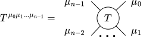
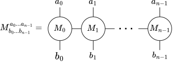
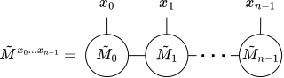
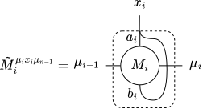

.. _sec:tensor_networks:

Tensor network formalism and tensor representation
--------------------------------------------------

It is convenient to denote tensors and their contractions using diagrams. In
this formalism tensor :math:`T^{\mu_0\mu_1\ldots\mu_{n-1}}` is represented as a
vertex of a graph with an edge for each index:

.. _eq:tnet_node:

and contraction of indices is depicted as a connection of these edges:

.. _eq:tnet_contr:

Tensor network formalism can be used to conveniently express the link product.
For a Hilbert space
:math:`\mathcal{H}=\bigotimes_{i=0}^{n-1}\mathcal{H}_i` with
:math:`d_i:=\dim \mathcal{H}_i` and a linear operator acting on it:

.. math::
   :label: eq:matrix_tensor

   M = \sum_{\substack{a_0, \ldots, a_{n-1} \\
                       b_0, \ldots, b_{n-1}}}
       M^{a_0 \ldots a_{n-1}}_{b_0 \ldots b_{n-1}}
       \ket{a_0 \ldots a_{n-1}}\bra{b_0 \ldots b_{n-1}},

we define the *tensor representation* of :math:`M` to be a tensor:

.. math::

   \tilde{M}^{x_0 \ldots x_{n-1}} =
   M^{a_0 \ldots a_{n-1}}_{b_0 \ldots b_{n-1}}
   \quad \mathrm{for} \quad x_i = d_i a_i + b_i.

Next, consider channels :math:`\mathrm{P}`, :math:`\mathrm{Q}` and
:math:`\mathrm{R} = \mathrm{P} * \mathrm{Q}` from :eq:`eq:chanels_example` and
:numref:`eq:chanels_example_diag`. One can easily check that tensor
representations of their CJ matrices satisfy:

.. _eq:tensor_link:

which mirrors the circuit diagram from :numref:`eq:chanels_example_diag`. Due to
the similarity of these two diagrams, in the main text we drop the symbol
:math:`\sim` and we depict strategies using circuit diagrams and tensor network
diagrams interchangeably.

When :math:`M` is an MPO:

.. _eq:mpo:

we can extend this definition to its components :math:`M_i` such that
:math:`\tilde{M}` will be a result of contraction of tensors
:math:`\tilde{M}_i`:

.. _eq:tensor_form_mpo:

.. _eq:tensor_form:
    

that is, only physical indices of :math:`M_i` are joined. This, combined with the
use of ``*`` to denote both link product and tensor contraction, allows for
convenient depiction of link product with CJ matrices which are MPOs.
