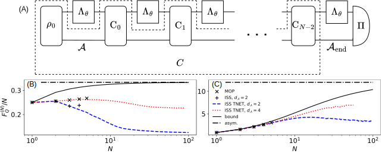

.. _sec:adaptive:

Adaptive strategy optimization
------------------------------

.. _fig:adaptive:

   (A) Diagram of an adaptive strategy with multiple parametrized
   channels :math:`\Lambda_\theta` and ancilla :math:`\mathcal{A}`.
   When the optimization is performed over all quantum combs
   :math:`C` (area bounded by dashed lines) one can control the
   dimension of only the final ancilla
   :math:`\mathcal{A}_\mathrm{end}`.
   Values of QFI normalized by the number of channel uses,
   :math:`N`, for: (B) dephasing (:math:`p=0.75`) (C) amplitude
   damping (:math:`p=0.75`) and different methods: MOP – black ×,
   simple ISS with :math:`d_\mathcal{A}=2` – black +, tensor network
   ISS with :math:`d_\mathcal{A}=2` – blue dashed line, tensor
   network ISS with :math:`d_\mathcal{A}=4` – red dotted line, upper
   bound – black solid line, asymptotic bound – black dash-dotted
   line. Lack of data for :math:`d_\mathcal{A}=4`, :math:`N \ge 90`
   (B) and :math:`N \ge 60` (C) is due to increasing numerical
   instability of ISS with growing :math:`N`.

In the adaptive strategy, we start with an initial state of the system
and the ancilla, :math:`\rho_0`, and we act on the system with
:math:`N` parameter-encoding channels :math:`\Lambda_\theta`,
intertwined with control operations :math:`\mathrm{C}_i` which act
both on the system and the ancilla, see :numref:`fig:adaptive` (A).
Equivalently, it is a strategy where :math:`N` parameter-encoding
channels :math:`\Lambda_\theta` are plugged in between the teeth of a
quantum comb :math:`C`, see :numref:`fig:linkadaptive`, and then the
resulting state is measured. In this strategy, one seeks to determine
the value of QFI for the optimal input state, measurement, and control
operations (or equivalently the optimal comb and measurement).
Notice that for sufficiently large ancilla dimension
:math:`d_\mathcal{A}` and for :math:`\mathrm{C}_i` being appropriate
SWAP gates one can simulate any parallel strategy with an adaptive
strategy. Thus, assuming the ancilla is large enough, the QFI for the
adaptive strategy always upper-bounds the QFI for the parallel
strategy.

QFI for the adaptive strategy using the MOP method can be computed by
invoking
:py:func:`mop_adaptive_qfi <qmetro.protocols.mop.mop_adaptive_qfi>`:

.. code-block:: python

   from qmetro import *

   p = 0.75
   channel = par_dephasing(p)

   N = 3

   qfi = mop_adaptive_qfi(channel, N)

This yields the truly optimal QFI corresponding to the optimal
adaptive strategy.

Alternatively, we may also use the ISS method, with the help of
:py:func:`iss_adaptive_qfi <qmetro.protocols.iss.iss_adaptive_qfi>`.
This procedure will perform the optimization over the whole comb as
well. Note that the constraints on a quantum comb :eq:`eq:comb_cond`
allow for its decomposition into control operations (CPTP maps), but
do not specify the ancilla dimension inside the comb. Therefore, in
this case one can control only the dimension of the last ancilla which
goes outside of the comb, indicated by the symbol
:math:`\mathcal{A}_\mathrm{end}` in :numref:`fig:adaptive` (A):

.. code-block:: python

   from qmetro import *

   p = 0.75
   channel = par_dephasing(p)

   N = 3
   ancilla_dim = 2

   qfi, qfis, comb, sld, status = iss_adaptive_qfi(channel, N, ancilla_dim)

Apart from the standard outputs for ISS-type functions,
:py:func:`iss_adaptive_qfi <qmetro.protocols.iss.iss_adaptive_qfi>`
returns ``comb`` which is a CJ matrix of the optimal comb.

Finally, if we want to make use of the tensor-network structure and
perform the optimization over separate control operations, we can use
:py:func:`iss_tnet_adaptive_qfi <qmetro.protocols.iss.iss_tnet_adaptive_qfi>`.
Notice that in this approach we control ancilla dimension at each step
and thus, in general, the obtained QFI will be smaller than the one
obtained with
:py:func:`iss_adaptive_qfi <qmetro.protocols.iss.iss_adaptive_qfi>`.
The advantage here is that the
optimization will be much more efficient and this is the only way to
reach large :math:`N`:

.. code-block:: python

   from qmetro import *

   p = 0.75
   channel = par_dephasing(p)

   N = 3
   ancilla_dim = 2

   qfi, qfis, teeth, sld, status = iss_tnet_adaptive_qfi(
       channel, N, ancilla_dim
   )

   rho0, *Cs = teeth

The returned argument ``teeth`` represents the comb's teeth and is a
list of the form ``[rho0, C_0, C_1, ..., C_{N-2}]``.

The upper bound for the adaptive strategy is computed using
:py:func:`ad_bounds <qmetro.bounds.bounds.ad_bounds>`:

.. code-block:: python

   from qmetro import *

   p = 0.75
   channel = par_dephasing(p)

   N = 3
   bound = ad_bounds(channel, N)

Additionally, one can compute the value of the bound in the limit
:math:`N \rightarrow \infty` which is asymptotically saturable and the
same for both the parallel and the adaptive strategy, see
Sec. :ref:`sec:bounds`:

.. code-block:: python

   from qmetro import *

   p = 0.75
   channel = par_dephasing(p)

   c, k = asym_scaling_qfi(channel)

The returned values should be interpreted as
:math:`c=\lim_{N\rightarrow\infty} F_Q^{(N)}(\Lambda_\theta)/N^k`.

Values of QFI, bounds, and asymptotic QFI for the adaptive strategy are
presented in :numref:`fig:adaptive` (B) and (C). In contrast to the
parallel strategy, the amplitude damping case (C) shows results much
closer to the bound.

Notice that there is no data for amplitude damping and ancilla dim
:math:`d_\mathcal{A}=4` and :math:`N \ge 60`. This is due to the fact
that for this noise model, the QFI attains a large value and
simultaneously optimal control operations :math:`\mathrm{C}_i` take the
state close to the pure state. These two processes combined create
objects (tensors, matrices etc.) which hold values from a very wide
range at the same time. This causes loss of precision and then
numerical instability. A similar issue appears for dephasing but for
much larger :math:`N\simeq90`.
