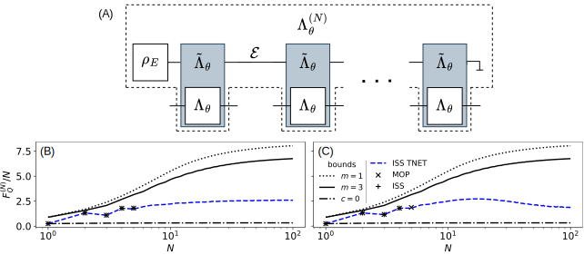
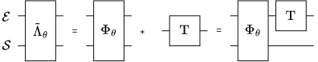

.. _sec:correlated:

Correlated noise models
-----------------------

.. _fig:corr:

   (A) Diagram of :math:`N` parametrized channels :math:`\Lambda_\theta`
   with noise correlations. Extended channels :math:`\tilde\Lambda_\theta`
   (gray) act on the system as :math:`\Lambda_\theta` and are connected
   with each other by the environment space :math:`\mathcal{E}`. The
   environment system :math:`\mathcal{E}` starts in the state
   :math:`\rho_E` and is not accessed (is traced out) at the end. Values
   of QFI normalized by the number of channel uses, :math:`N`, for
   anti-correlated (:math:`c=-0.75`) dephasing (:math:`p=0.75`),
   different strategies: (B) parallel, (C) adaptive and various methods:
   MOP - black :math:`\times`, simple ISS with :math:`d_\mathcal{A}=2` -
   black +, tensor network ISS with :math:`d_\mathcal{A}=2` (parallel:
   :math:`r_\mathrm{MPS}=\sqrt{r_\mathfrak{L}}=2`) - blue dashed line, upper
   bound with block size :math:`m=1` - black dotted line, upper bound with
   block size :math:`m=3` - black solid line and upper bound for
   uncorrelated channels :math:`c=0` - black dash-dotted line. Notice that
   since there are no separate bounds for parallel strategy with
   correlated channels the upper bounds (black dotted and solid lines)
   are identical in (B) and (C).

The QMetro++ also provides a simple way to compute the QFI for the
adaptive and the parallel strategies in scenarios when parameter-
encoding channels act on an additional environment space
:math:`\mathcal{E}` which directly connects subsequent channels, see
:numref:`fig:corr` (A). This approach allows in particular to model noise
correlations affecting the sensing channels.

To illustrate this, let us consider a Kraus representation for the
dephasing model with Kraus operators :math:`K_\pm` acting as Bloch-sphere
rotations by :math:`\pm\epsilon` around :math:`z` axis, see
:eq:`eq:pardeph2`. We want the signs of these rotations to form a binary
Markovian chain. The conditional probability of a rotation with sign
:math:`s_i\in\{+,-\}` in channel :math:`i` given :math:`s_{i-1}` in
channel :math:`i-1` is:

.. math::
   :label: eq:corr_prob

   T_{i|i-1}(s_i|s_{i-1}) = \frac{1}{2}(1+s_i s_{i-1} c),

where :math:`c\in[-1, 1]` is a correlation parameter with :math:`c=0`
meaning no correlations, :math:`c=1` maximal positive correlations and
:math:`c=-1` maximal negative correlations. The initial probabilities
are :math:`p(\pm)=1/2`.

.. _fig:extchannel:

   Modeling of correlated dephasing process, by extending the action of
   the channel on a two-dimensional environment space.

This process can be modeled with the help of a two-dimensional
environment Hilbert space :math:`\mathcal{E}` which will carry the
information about the sign of the rotation in the preceding step.

Let us introduce a new channel acting on both the environment and the
system :math:`\tilde\Lambda_\theta = \Phi_\theta * \mathrm{T}`, see
:numref:`fig:extchannel`, where:

.. math::
   :label: eq:corr_constr

   \Phi_\theta : \mathcal{L}(\mathcal{E} \otimes \mathcal{S}) \ni \rho
   \mapsto V_\theta\rho V_\theta^\dagger\in
   \mathcal{L}(\mathcal{E} \otimes \mathcal{S}), \\
   V_\theta=\sqrt{2}\sum_{s=\pm} \ket{s}\bra{s} \otimes K_{s, \theta},

and

.. math::
   :label: eq:corr_constr2

   \mathrm{T} : \mathcal{L}(\mathcal{E}) \ni \rho_E\mapsto \sum_{s, r = \pm}
   T_{sr}\rho_E T_{sr}^\dagger\in \mathcal{L}(\mathcal{E} ), \\
   T_{sr}=\sqrt{\frac{1+s r c}{2}}\ket{s}\bra{r}.

Clearly, :math:`\tilde\Lambda_\theta` acts as :math:`\Lambda_\theta` on
the system —
:math:`\mathrm{Tr}_{\mathcal{E}}\tilde\Lambda_\theta(\rho)=\Lambda_\theta(\mathrm{Tr}_{\mathcal{E}}\rho)`
for any state
:math:`\rho`. The unitary channel :math:`\Phi_\theta` acts with
:math:`K_\pm` on the system, depending on the state of the environment
being :math:`\ket{\pm}`, and it stores the information about the
occurrence of :math:`K_\pm` in the state :math:`\ket{\pm}` accordingly.
Then :math:`\mathrm{T}` modifies the state of :math:`\mathcal{E}`
according to probabilities :eq:`eq:corr_prob`. The initial probabilities
are encoded in the initial environment state
:math:`\rho_E=\mathbb{1}_2/2`.

Channel :math:`\tilde\Lambda_\theta` can be easily constructed using the
:meth:`link_env <qmetro.param_channel.param_channel.ParamChannel.link_env>`
method which links two channels through their common environment:

.. code-block:: python

   from numpy import array, kron, sqrt
   from qmetro import par_dephasing, ket_bra, ParamChannel

   p = 0.75
   c = -0.75

   Lambda = par_dephasing(p, rot_like=True)
   krauses, dkrauses = Lambda.dkrauses()
   Kp, Km = krauses
   dKp, dKm = dkrauses

   plus = array([1, 1]) / sqrt(2)
   minus = array([1, -1]) / sqrt(2)

   V = kron(ket_bra(plus, plus), Kp)
   V = V + kron(ket_bra(minus, minus), Km)
   V = sqrt(2) * V

   dV = kron(ket_bra(plus, plus), dKp)
   dV += kron(ket_bra(minus, minus), dKm)
   dV = sqrt(2) * dV

   Phi = ParamChannel(krauses=[V], dkrauses=[dV], env_dim=2)

   T_krauses = []
   for s in (1, -1):
       for r in (1, -1):
           x = sqrt((1+s*r*c)/2)
           Tsr = x * ket_bra(array([1, s]), array([1, r]))/2
           T_krauses.append(Tsr)

   T = ParamChannel(krauses=T_krauses, env_dim=2)

   Lambda_tilde = Phi.link_env(T)
   Lambda_tilde = Phi * T

When provided with ``env_dim`` argument, the constructor of
:class:`ParamChannel <qmetro.param_channel.param_channel.ParamChannel>`
will assume that the channel acts on a space
:math:`\mathcal{E} \otimes \mathcal{S}` with :math:`\dim\mathcal{E}`
given by the argument. All functions implementing MOP and ISS algorithms
from :ref:`sec:parallel` and :ref:`sec:adaptive` can take such a channel
as their argument and optimize the corresponding QFI for a sequence of
channels as in :numref:`fig:corr` (A):

.. code-block:: python

   ...

   from numpy import identity
   from qmetro import iss_tnet_adaptive_qfi

   N = 3
   d_a = 2
   qfi, *_ = iss_tnet_adaptive_qfi(Lambda_tilde, N, d_a)

   rhoE = identity(2) / 2
   qfi, *_ = iss_tnet_adaptive_qfi(Lambda_tilde, N, d_a, env_inp_state=rhoE)

Bounds in this case can be computed using
:py:func:`ad_bounds_correlated <qmetro.bounds.bounds.ad_bounds_correlated>`
and
:py:func:`ad_asym_bound_correlated <qmetro.bounds.bounds.ad_asym_bound_correlated>`.
In contrast to the bounds for the
uncorrelated case these bounds are not necessarily tight asymptotically.
They are computed by upper-bounding QFI for adaptive strategy where every
:math:`m`-th control operation has access to the environment, for some
integer :math:`m`. This leads to a leakage of information from the
environment, which weakens the tightness of the bound.

Naturally, larger value of :math:`m` makes the bound tighter but at the
same time it exponentially increases the execution time. Realistically,
one can compute the bound for :math:`m \lesssim 5` in case of qubit
channels. An exemplary code to compute the bound is given below:

.. code-block:: python

   ...

   from qmetro import ad_bounds_correlated

   N = 10
   m = 3
   ns, bound = ad_bounds_correlated(Lambda_tilde, N, m)

where ``ns = [1, 1+m, 1+2m, ...]``, ``bound = [b_1, b_{1+m}, b_{1+2m}, ...]``
and ``b_n`` is an upper bound on
:math:`F_{Q}^{(n)}(\Lambda_\theta)`.

Note that the construction :eq:`eq:corr_constr`, :eq:`eq:corr_constr2` is
not unique and correlations :eq:`eq:corr_prob` can be modeled using
different :math:`\tilde\Lambda_\theta`. For example a quantum channel:

.. math::
   :label: eq:corr_constr3

   \mathrm{t} : \mathcal{L}(\mathcal{E}) \ni \rho \mapsto \sum_{s, r}
   t_{sr}\rho\, t_{sr}^\dagger\in \mathcal{L}(\mathcal{E} ), \\
   t_{sr}=\sqrt{\frac{1+s r\sqrt c}{2}}\ket{s}\bra{r},

satisfies :math:`\mathrm{t}\circ \mathrm{t}=\mathrm{T}` thus
:math:`\tilde\Lambda_\theta = \mathrm{t}*\Phi_\theta*\mathrm{t}` will give
the same
:math:`\Lambda^{(N)}_\theta=\tilde\Lambda_\theta * ... * \tilde\Lambda_\theta`
as before. This observation is important for calculation of upper-bounds
because of the aforementioned fact that they are not computed for the
whole :math:`\tilde\Lambda_\theta^{(N)}` but for :math:`N/m` blocks of
size :math:`m` and the construction influences how these blocks begin and
end. For example, it turns out that the original construction
:eq:`eq:corr_constr2` gives in this case an unrealistic HS and the optimal
bound is achieved for :eq:`eq:corr_constr3`, see
:cite:`kurdzialek2024bounds` for more discussion.

Values of the QFI for anti-correlated (:math:`c=-0.75`) dephasing case are
shown in :numref:`fig:corr` (B) and (C). Note, that the presence of
(anti)correlations significantly increases the obtained QFI which becomes
even larger then the upper-bounds for uncorrelated case. Interestingly,
we can see that the adaptive strategy with :math:`d_\mathcal{A}=2` is
optimal for :math:`N\le 5`, unlike in the uncorrelated dephasing case, see
:numref:`fig:adaptive` (B).
