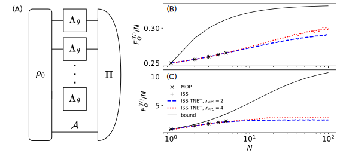

.. _sec:parallel:

Parallel strategy optimization
------------------------------

.. _fig:parallel:

   (A) Diagram of a parallel strategy with multiple parametrized
   channels :math:`\Lambda_\theta` and ancilla :math:`\mathcal{A}`.
   Values of QFI normalized by the number of channel uses, :math:`N`,
   for: (B) dephasing (:math:`p=0.75`), (C) amplitude damping
   (:math:`p=0.75`) and different methods: MOP – black ×, simple ISS
   with :math:`d_\mathcal{A}=2` – black +, tensor network ISS with
   :math:`d_\mathcal{A}=2, \; r_\mathrm{MPS}=\sqrt{r_\mathfrak{L}}=2`
   – blue dashed line, tensor network ISS with
   :math:`d_\mathcal{A}=2, \; r_\mathrm{MPS}=\sqrt{r_\mathfrak{L}}=4`
   – red dotted line, upper bound – black solid line.

The parallel strategy refers to a setting in which :math:`N` copies of
:math:`\Lambda_\theta` are probed in parallel by an entangled state and
their output is collectively measured, see :numref:`fig:parallel` (A).
It can also be understood as a strategy with a single channel
:math:`\Lambda_\theta^{(N)}=\Lambda_\theta^{\otimes N}`. The QMetro++
package provides several functions computing the QFI for the parallel
strategy. The simplest two,
:py:func:`iss_parallel_qfi <qmetro.protocols.iss.iss_parallel_qfi>` and
:py:func:`mop_parallel_qfi <qmetro.protocols.mop.mop_parallel_qfi>`,
are straightforward generalizations of ISS and MOP methods for the
parallel strategy:

.. code-block:: python

   from qmetro import *

   p = 0.75
   channel = par_dephasing(p)

   N = 3
   ancilla_dim = 2
   iss_qfi, qfis, rho0, sld, status = iss_parallel_qfi(channel, N, ancilla_dim)

   mop_qfi = mop_parallel_qfi(channel, N)

The downside of these two approaches is that they try to optimize QFI
over all possible states and measurements on an exponentially large
Hilbert space. Hence, their time and memory complexity are exponential
in the number of channel uses. In practice, this means that they can be
used for relatively small :math:`N`
(:math:`N \lesssim 5` in case of qubit channels).

This problem can be circumvented using tensor networks MPS
:numref:`eq:mps` and MPO :numref:`eq:sld_mpo`.
This approach is implemented in
:py:func:`iss_tnet_parallel_qfi <qmetro.protocols.iss.iss_tnet_parallel_qfi>`,
which requires two additional arguments specifying bond dimensions of
the MPS and the pre-SLD MPO:

.. code-block:: python

   from qmetro import *

   p = 0.75
   channel = par_dephasing(p)

   N = 3
   ancilla_dim = 2
   mps_bond_dim = 2
   L_bond_dim = 4

   qfi, qfis, psis, Ls, status = iss_tnet_parallel_qfi(
       channel, N, ancilla_dim, mps_bond_dim, L_bond_dim
   )

In contrast to the function implementing the basic ISS, which returns
the optimal input state and the SLD in terms of arrays, this procedure
gives them in the form of lists containing tensor components:
``psis = [psi_0, psi_1, ...]`` and ``Ls = [L_0, L_1, ...]``, see
:numref:`eq:mps` and :numref:`eq:sld_mpo`.

Naturally, increasing ancilla and bond dimensions allows one to achieve
higher values of QFI up to some optimal value, see
:numref:`fig:parallel` (B) and :numref:`fig:parallel` (C). One might
assess this value by running
:py:func:`iss_tnet_parallel_qfi <qmetro.protocols.iss.iss_tnet_parallel_qfi>`
for progressively larger dimension sizes, but it can also be
upper-bounded using the
:py:func:`par_bounds <qmetro.bounds.bounds.par_bounds>` function which
gives a bound on the QFI of the parallel strategy for all ancilla and
bond dimension sizes (see Sec. :ref:`sec:bounds`):

.. code-block:: python

   from qmetro import *

   p = 0.75
   channel = par_dephasing(p)

   N = 3

   bound = par_bounds(channel, N)

The obtained value is an array ``bound = [b_1, b_2, ..., b_N]`` where
``b_n`` is an upper bound on
:math:`F_Q^{(n)}(\Lambda_\theta)`.

The numerical results are presented in :numref:`fig:parallel` (B) and
(C). We considered the parallel strategy with ancilla dimension
:math:`d_\mathcal{A}` and various bond dimensions
:math:`r_\mathrm{MPS}=\sqrt{r_\mathfrak{L}}`. The relation between 
:math:`r_{\mathrm{MPS}}$ and $r_{\mathfrak{L}}` was chosen based on
the fact that the density matrix of the input state has bond 
dimension equal to :math:`r_\mathrm{MPS}^2`, so taking
:math:`r_\mathfrak{L}` up to this value should not significantly affect
the execution time (in practice, a smaller :math:`r_\mathfrak{L}` is
typically sufficient). Notice that for the dephasing case (B) results
from MOP and ISS methods coincide perfectly
and that QFI for MPS with :math:`r_\mathrm{MPS}=4` approaches the upper
bound as :math:`N` increases. This suggests that in this case
:math:`d_\mathcal{A}=2` is sufficient to saturate the bound. On the
other hand, for the amplitude damping case (C) the results obtained
using MOP and ISS differ, and already for :math:`N=5` the ancilla
dimension :math:`d_\mathcal{A}=2` is suboptimal. Additionally,
:math:`F_Q^{(N)}(\Lambda_\theta)/N` computed using MPS quickly flattens
out and the increase of bond dimension leads to a very small
improvement. Therefore, we can conclude that in this case the
dimensions :math:`d_\mathcal{A}` considered are insufficient to
saturate the bound.
