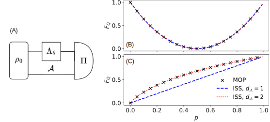

.. _sec:single:

Single-channel QFI optimization
-------------------------------

.. _fig:single:

   (A) Diagram of a strategy with a single parameter-dependent channel
   :math:`\Lambda_\theta` and ancilla :math:`\mathcal{A}`. Values of QFI
   for (B) dephasing and (C) amplitude damping, for various values of
   :math:`p` and for different methods: MOP – black ×, ISS with
   :math:`d_\mathcal{A}=1` – blue dashed line, ISS with
   :math:`d_\mathcal{A}=2` – red dotted line.

After defining the parameter-dependent channel using the
:py:class:`ParamChannel <qmetro.param_channel.param_channel.ParamChannel>`
class, we may now easily compute the single-channel QFI
:eq:`eq:channelqfi`, including the possible use of an ancilla, see
:numref:`fig:single` (A). The channel QFI can be computed using one of
the two functions:

- :py:func:`iss_channel_qfi <qmetro.protocols.iss.iss_channel_qfi>` for
  the ISS method,
- :py:func:`mop_channel_qfi <qmetro.protocols.mop.mop_channel_qfi>` for
  the MOP method.

The function
:py:func:`iss_channel_qfi <qmetro.protocols.iss.iss_channel_qfi>` takes
two arguments: the channel whose QFI is computed and the dimension of
the ancillary system. It returns five items: the optimized QFI, a list
of pre-QFI values per algorithm iteration, the density matrix of the
optimal input state, the SLD matrix, and the information whether the
optimization converged successfully.

On the other hand,
:py:func:`mop_channel_qfi <qmetro.protocols.mop.mop_channel_qfi>` takes
only the channel and returns only the QFI—here, by the nature of the
method, ancillary system dimension is unspecified, see Sec.
:ref:`sec:mop`. The following code shows both of these functions in
practice:

.. code-block:: python

   from qmetro import *

   p = 0.75
   channel = par_dephasing(p)

   ancilla_dim = 2
   iss_qfi, qfis, rho0, sld, status = iss_channel_qfi(channel, ancilla_dim)

   mop_qfi = mop_channel_qfi(channel)

:numref:`fig:single` (B) and :numref:`fig:single` (C) present plots of
the results obtained using
:py:func:`iss_channel_qfi <qmetro.protocols.iss.iss_channel_qfi>` and
:py:func:`mop_channel_qfi <qmetro.protocols.mop.mop_channel_qfi>` for
the two decoherence models respectively. Since the MOP method gives the
optimal QFI implicitly assuming arbitrary ancilla dimension
:math:`d_\mathcal{A}`, these plots indicate that for the dephasing case
(B) the ancilla is in fact unnecessary, while in the amplitude damping
case (C) the ancillary system of dimension :math:`d_\mathcal{A}=2` is
required for an optimal precision.

This example clearly shows the benefits of having two independent
optimization procedures. One method (MOP) provides the true optimal QFI,
but does not allow us to gain insight into the required ancilla size,
while the other one (ISS) allows us to study the impact of the ancilla
size.
