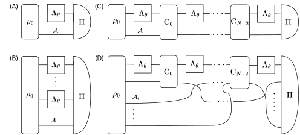
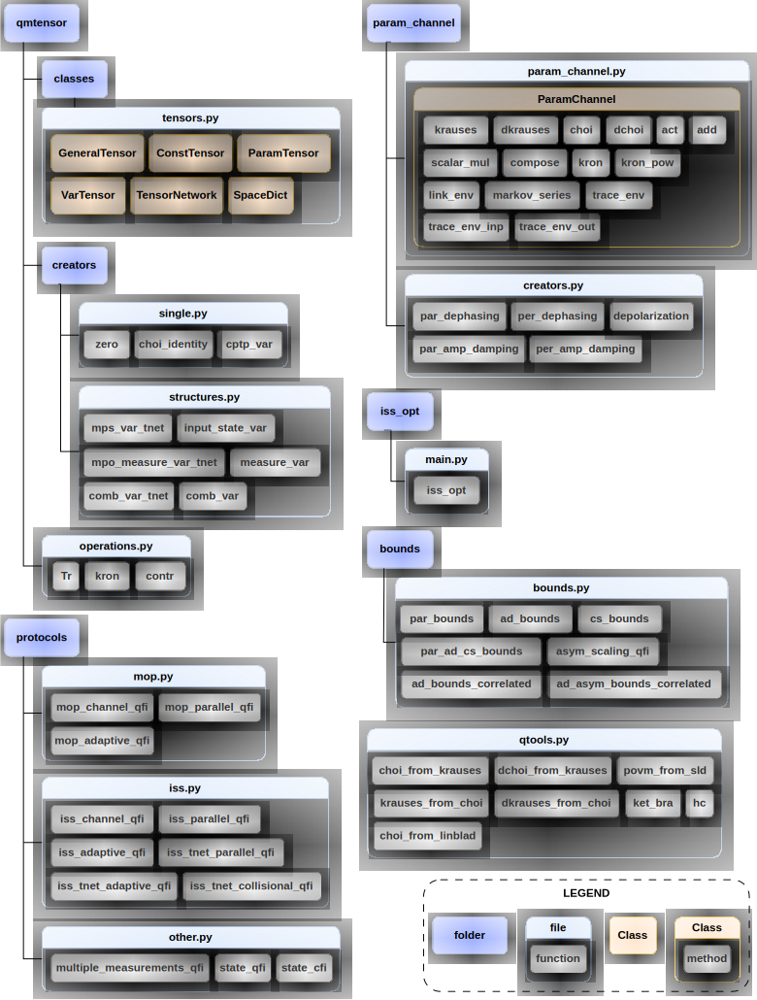

Theoretical background
======================

Quantum metrology :cite:`Giovaennetti2006,Toth2014,PezzeSmerziOberthalerEtAl2018,Polino2020`
is now rightfully regarded as
one of the main pillars of the rapidly developing field of quantum
technologies :cite:`Simon2025`. It focuses on the ways to exploit
delicate quantum features of light and matter to enhance the
sensitivity of practical measuring devices. Apart from numerous
experimental breakthroughs in the field, including the use of
squeezed states of light in gravitational wave detectors
:cite:`Schnabel2017,LIGO2023`, quantum-enhanced magnetometry
:cite:`Troullinou2023`, gravitometry :cite:`Cassen2025`, atomic clocks
:cite:`PedrozoPeafiel2020` and many others, the field has also enjoyed
significant theoretical progress with numerous analytical and
numerical methods being developed that help to design better
metrological protocols as well as understand the fundamental
limitations of quantum-enhanced protocols in the presence of
decoherence :cite:`Escher2011,Demkowicz2012,Demkowicz2014,demkowicz2015,Demkowicz2017,Zhou2018,Chabuda2020,Zhou2021,Altherr2021,Liu2023,Kurdzialek2023,kurdzialek2024,Liu2024`.

The purpose of this package is to make these advanced and powerful
numerical methods accessible to the community. We realize that despite
the fact that the core elements of the methods have been discussed in
the literature already for a couple of years, they are still not
widely used in the field due to their somewhat steep 'initial learning
curve' and the fact that there is no single publication that provides
a unified presentation of all of them, not to mention a numerical
package. Moreover, we significantly expand the applicability of the
latest tensor network-based methods to include general protocol
structures, which allows for dealing with e.g. collisional
metrological schemes.

This package adopts the frequentist approach to quantum metrology and
focuses on quantum Fisher information (QFI) as the figure-of-merit to
be optimized :cite:`Helstrom1976, Braunstein1994, Paris2009`. At this
point, we do not include quantum Bayesian methods in the package, even
though some of the optimization procedures discussed here have their
Bayesian counterparts, and may be added in the future updates.

.. _fig:intro:

   Different classes of metrological strategies that one can optimize
   using the package: (A) optimization of a *single channel* input
   probe :math:`\rho_0` (potentially entangled with an ancillary system
   :math:`\mathcal{A}`), (B) optimization of an entangled state
   :math:`\rho_0` of :math:`N` input probes in a *parallel* strategy
   (potentially additionally entangled with an ancillary system
   :math:`\mathcal{A}`), (C) optimization of an input probe
   :math:`\rho_0` and control operations :math:`C_i` in an *adaptive*
   metrological scheme, (D) a *customized* protocol structure, here
   inspired by quantum collisional models, where multi-partite
   entangled ancillary state is sent piece-by-piece to interact with a
   common sensing system via interaction gates :math:`C_i`. Here the
   optimization may affect either the input state :math:`\rho_0` or
   interaction gates :math:`C_i` or both. The above strategies
   correspond to functions listed in :numref:`tab:summary`.

.. _tab:summary:

.. list-table:: Summary of main functions in QMetro++ package
   :header-rows: 1
   :align: center

   * - strategy
     - :math:`N` regime
     - package functions
     - section
   * - (A) single channel
     - 1
     - :py:func:`mop_channel_qfi <qmetro.protocols.mop.mop_channel_qfi>`,
       :py:func:`iss_channel_qfi <qmetro.protocols.iss.iss_channel_qfi>`
     - :ref:`sec:single`
   * - (B) parallel
     - small
     - :py:func:`mop_parallel_qfi <qmetro.protocols.mop.mop_parallel_qfi>`,
       :py:func:`iss_parallel_qfi <qmetro.protocols.iss.iss_parallel_qfi>`
     - :ref:`sec:parallel`
   * - (B) parallel
     - large
     - :py:func:`iss_tnet_parallel_qfi <qmetro.protocols.iss.iss_tnet_parallel_qfi>`
     - :ref:`sec:parallel`
   * - (B) parallel, bound
     - large
     - :py:func:`par_bounds <qmetro.bounds.bounds.par_bounds>`
     - :ref:`sec:parallel`
   * - (C) adaptive
     - small
     - :py:func:`mop_adaptive_qfi <qmetro.protocols.mop.mop_adaptive_qfi>`,
       :py:func:`iss_adaptive_qfi <qmetro.protocols.iss.iss_adaptive_qfi>`
     - :ref:`sec:adaptive`
   * - (C) adaptive
     - large
     - :py:func:`iss_tnet_adaptive_qfi <qmetro.protocols.iss.iss_tnet_adaptive_qfi>`
     - :ref:`sec:adaptive`
   * - (C) adaptive, bound
     - large
     - :py:func:`ad_bounds <qmetro.bounds.bounds.ad_bounds>`
     - :ref:`sec:adaptive`
   * - (C) corr. noise bound
     - large
     - :py:func:`ad_bounds_correlated <qmetro.bounds.bounds.ad_bounds_correlated>`
     - :ref:`sec:correlated`
   * - (D) customized
     - large
     - :py:func:`iss_opt <qmetro.iss_opt.main.iss_opt>` + ...
     - :ref:`sec:advanced`

.. _fig:scheme:

   File structure of the package with a selection of the most important
   functions. Classes from :ref:`sec:api_tensors` file are displayed in more
   detail in :numref:`fig:classes`. All functions, classes and
   methods are listed and described in the package documentation
   :cite:`dulian2025`.

.. toctree::
   :maxdepth: 1

   estimation
   qfi
   mop
   iss
   bounds
