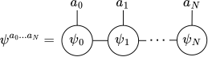
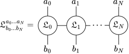
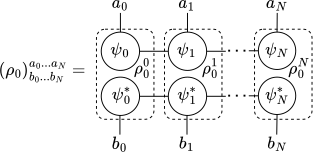

.. _sec:iss:

Iterative see-saw
-----------------

In the ISS optimization method developed in the context of quantum
metrology :cite:`Demkowicz2011, Macieszczak2013, Macieszczak2014,
Toth2018, Chabuda2020, Geza2022, kurdzialek2024` one considers the
*pre-QFI function*:

.. math::
   :label: eq:preqfi

   F(\rho_0, \mathfrak{L}) :=
   2\mathrm{Tr}\!\left( \dot \rho_\theta \mathfrak{L} \right)
   - \mathrm{Tr}\!\left(\rho_\theta \mathfrak{L}^2 \right),

where
:math:`\rho_\theta = \Lambda_\theta \otimes \mathbb{I}_\mathcal{A}
(\rho_0)`, and the dimension of :math:`\mathcal{A}` can be chosen
arbitrarily and this choice may affect the final result, unlike in the
MOP method. It turns out that for a given :math:`\rho_0` the maximization
of :math:`F` over Hermitian matrices :math:`\mathfrak{L}` yields the QFI
of the state :math:`\rho_\theta`:

.. math::

   \max_{\mathfrak{L}=\mathfrak{L}^\dagger}
   F(\rho_0, \mathfrak{L}) = F_Q(\rho_\theta),

with the solution :math:`\mathfrak{L}^\diamond` equal to the SLD matrix
:math:`L` of :math:`\rho_\theta` :cite:`Macieszczak2013`—hence we will
refer to :math:`\mathfrak{L}` as the *pre-SLD matrix* for
:math:`\mathfrak{L}`. It follows that the channel QFI
:eq:`eq:channelqfi` is simply a maximization of :math:`F` over both of
its arguments:

.. math::

   F_Q(\Lambda_\theta) =
   \max_{\rho_0, \mathfrak{L}} F(\rho_0, \mathfrak{L}).

This problem can be solved by initializing :math:`\rho_0` and
:math:`\mathfrak{L}` at random and then by alternately making one
argument constant and maximizing the other one. Each such optimization
will increase the value of :math:`F` and we can proceed until the change
of :math:`F` in a number of consecutive iterations becomes smaller than
some established precision :math:`\epsilon`. In case of the
single-channel optimization the procedure is implemented in
:py:func:`iss_channel_qfi
<qmetro.protocols.iss.iss_channel_qfi>`.

ISS algorithm can be easily applied to the parallel strategy by simply
substituting :math:`\Lambda_\theta` with
:math:`\Lambda^{(N)}_\theta = \Lambda^{\otimes N}_\theta`—this is
implemented in :py:func:`iss_parallel_qfi
<qmetro.protocols.iss.iss_parallel_qfi>` function. This approach,
however, suffers from the same problem as MOP—namely, it has an
exponential complexity in :math:`N`.

The solution is to split :math:`\rho_0` and :math:`\mathfrak{L}` into
smaller parts by expressing them as tensor networks (see Appendix
:ref:`sec:tensor_networks`). Let us set
:math:`\mathcal{I}^{(N)} = \bigotimes_{i=0}^N\mathcal{I}_i` and
:math:`\mathcal{O}^{(N)} = \bigotimes_{i=0}^N\mathcal{O}_i`, where for
:math:`i< N` spaces :math:`\mathcal{I}_i` and :math:`\mathcal{O}_i` are
inputs and outputs of the :math:`i`-th channel
:math:`\Lambda_{\theta, i}` and
:math:`\mathcal{I}_N=\mathcal{O}_N=\mathcal{A}`. Then a state

.. math::

   \ket{\psi} =
   \sum_{a_0,..., a_N}
   \psi^{a_0...a_N}\ket{a_0...a_N}
   \in \mathcal{I}^{(N)},

can be expressed as a tensor network called a *matrix product state*
(MPS) :cite:`Bridgeman2017, Schollwock2011`:

.. _eq:mps:

   Matrix product state.

where indices :math:`a_i` are called *physical indices* and horizontal
indices that connect tensors :math:`\psi_i` are called *bond indices*.
Range of the bond indices, called the *bond dimension* and denoted by
:math:`r_\mathrm{MPS}`, controls the strength of possible correlations
between sites of :math:`\ket{\psi}`, :math:`r_\mathrm{MPS}=1` means that
the state is separable and
:math:`r_\mathrm{MPS}\approx\dim\mathcal{I}^{(N)}` allows for arbitrary
correlations. Analogously, pre-SLD matrix can be expressed as a *matrix
product operator* (MPO):

.. _eq:sld_mpo:

   Matrix product operator of :math:`\mathfrak{L}`.

with bond dimension :math:`r_\mathfrak{L}`. We can then write the
pre-QFI function as

.. math::

   F(\psi_0, ..., \psi_N, \mathfrak{L}_0, ..., \mathfrak{L}_N) =
   ✱_{i=0}^{N} \rho_0^i *
   \left[
   2\dot{ \mathit{\Lambda}}_{\theta}^{(N)} *
   \left( ✱_{i=0}^{N} \mathfrak{L}_i \right)^T
   - \mathit{\Lambda}_{\theta}^{(N)} *
   \left( ✱_{i=0}^{N} \mathfrak{L}_i^2 \right)^T
   \right],

where :math:`\rho_0^i` are elements of the density matrix MPO of the
state :math:`\ket{\psi}`:

.. _eq:mps_density_mat:

   Density matrix MPO of the MPS state.

:math:`\psi_i^*` are entry-wise complex conjugations of :math:`\psi_i`
and :math:`\mathfrak{L}_i^2` are elements of MPO of
:math:`\mathfrak{L}^2`. Additionally, we used linearity of link product
and the identity :math:`\mathrm{Tr}(AB) = A*B^T`. Note that
:math:`\ast` denotes link product operation, but also contraction of
corresponding spaces for more general tensor networks, e.g. MPSs, see
Appendix :ref:`sec:tensor_networks` for more details.

Just like in the case of a single channel optimization, we can maximize
the above function over one argument at a time while others stay
constant. Then after optimization of each argument, we repeat the
procedure until the value of :math:`F` converges. Note that if
:math:`r_\mathfrak{L}` is too small, then the optimization over pre-SLD
will not converge to the SLD matrix and value of pre-QFI will not be
equal to QFI. Nevertheless, the obtained value of :math:`F` can always
be interpreted as a CFI for a measurement given by eigenvectors of
:math:`\mathfrak{L}` :cite:`Macieszczak2013`. The procedure employing
MPS and MPO to the optimization of parallel strategy is implemented in
:py:func:`iss_tnet_parallel_qfi
<qmetro.protocols.iss.iss_tnet_parallel_qfi>`.

For the adaptive strategy we can apply the formula on
:math:`\rho_\theta` from :numref:`fig:linkadaptive` to
:eq:`eq:preqfi` and redefine pre-QFI function as

.. math::
   :label: eq:preqfi_ad

   F(C, \mathfrak{L}) =
   2 C * \dot{ \mathit{\Lambda}}_{\theta}^{(N)} * \mathfrak{L}^T
   - C * \mathit{\Lambda}_{\theta}^{(N)} * (\mathfrak{L}^2)^T.

Then, the QFI for adaptive strategy becomes a maximization of
:eq:`eq:preqfi_ad` over Hermitian :math:`\mathfrak{L}` and quantum
combs :eq:`eq:comb_cond`—this is implemented in
:py:func:`iss_adaptive_qfi <qmetro.protocols.iss.iss_adaptive_qfi>`. Once more, this problem can be
solved more efficiently if we split arguments of :math:`F` into smaller
parts. This time, however, the tensor network of :math:`\textrm{C}` has
a natural interpretation as an input state :math:`\rho_0` and a series
of control operations :math:`\mathrm{C}_i` like in
:numref:`fig:intro` (C). Thus we can optimize

.. math::
   :label: eq:preqfi_ad_tnet

   F(\rho_0, C_0, ..., C_{N-2}, \mathfrak{L}) =
   \rho_0 *
   ✱_{i=0}^{N-2} C_i *
   \left[
   2\dot{ \mathit{\Lambda}}_{\theta}^{(N)} * \mathfrak{L}^T
   - \mathit{\Lambda}_{\theta}^{(N)} * (\mathfrak{L}^2)^T
   \right].

We implemented this procedure in
:py:func:`iss_tnet_adaptive_qfi <qmetro.protocols.iss.iss_tnet_adaptive_qfi>`.

Finally, ISS can be applied to any arrangement of input states, control
operations and parametrized channels, see the example in
:numref:`fig:intro` (D). This is done by expressing
:math:`\rho_\theta` as the contraction of tensors representing all
channels, measurements (possibly represented by MPOs) and states
(possibly represented by MPSs) and maximizing pre-QFI over each
variable node separately. The package provides tools to define such
arbitrary protocols which can be then optimized using
:py:func:`iss_opt <qmetro.iss_opt.main.iss_opt>` function. We discuss
this in detail in Sec. :ref:`sec:advanced`.

Let us conclude this section with a comparison of MOP and ISS. MOP is a
deterministic algorithm with optimality of the numerical solution
guaranteed by formal proofs. ISS initializes the parameters of pre-QFI
function at random, thus it is nondeterministic. Additionally, there is
no guarantee that it converges to the true optimum of the pre-QFI
function. The optimality can be validated in some cases by comparing its
result with MOP or upper bounds, see Sec. :ref:`sec:bounds`. It might be
also useful to repeat the computation several times and check whether
the returned values vary.

On a positive side, what is guaranteed in ISS is that the figure of
merit will not decrease at any individual iteration step and that the
final result will always be a correct *lower bound* of a truly optimal
QFI.

Moreover, ISS is much more efficient than MOP. Its exact time
complexity depends on the strategy and it is hard to estimate. Our
numerical data shows that for strategies that are similar to parallel
or adaptive strategy and with the use of tensor networks the time
complexity is quadratic in :math:`N`. This is significantly better than
exponential complexity of MOP and allows to compute QFI for
significantly larger values of :math:`N` (:math:`N\le5` for MOP vs
:math:`N\le 100` for ISS). Moreover, in ISS we can control additional
parameters like ancilla or bond dimension and consider strategies
different from parallel and adaptive. Finally, while both methods can
be used to get the optimal adaptive or parallel protocols, it is much
more straightforward for ISS, as it requires only inspecting the final
values of the pre-QFI function optimized arguments.
